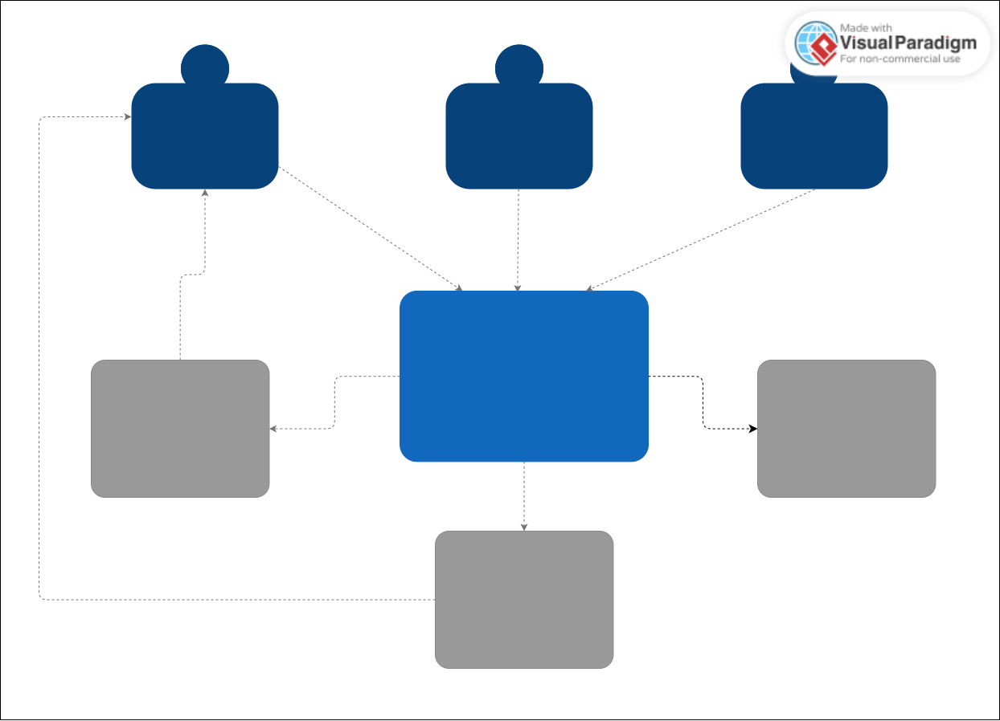
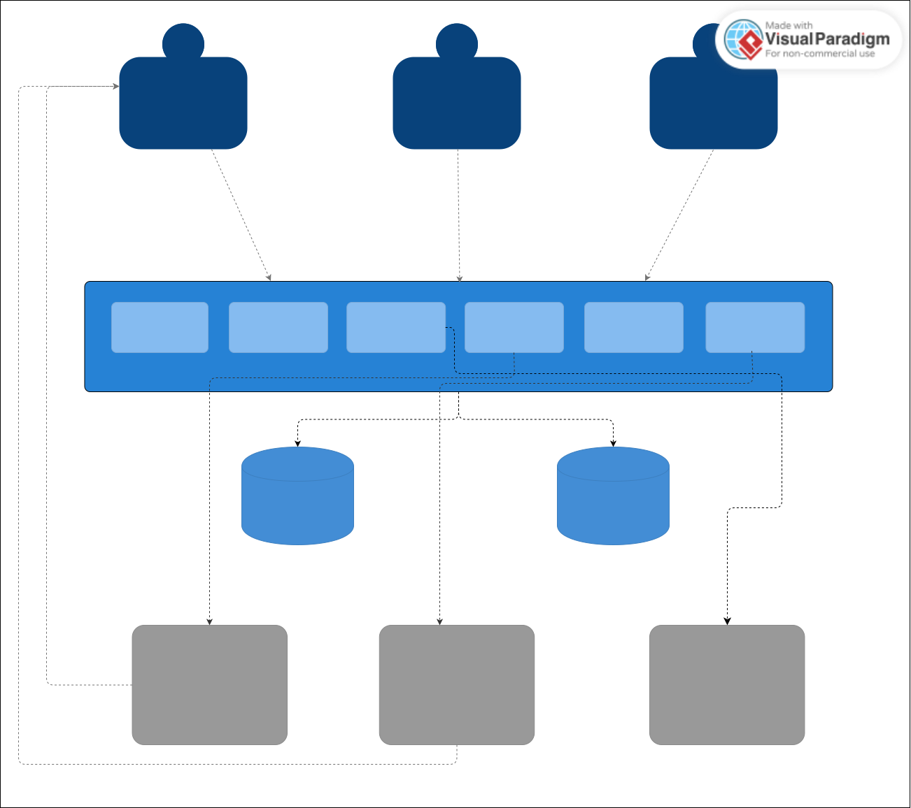
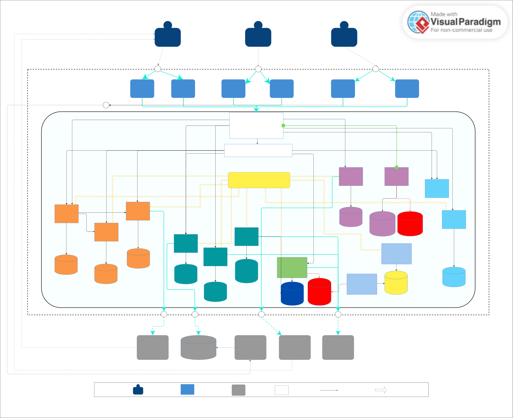

# Проектная работа: интернет-сервис по размещению объявлений

## Глоссарий

- **Highload** (высоконагруженная система) — категория информационных систем и приложений, в которых объем входящих запросов, обрабатываемых данных или выполняемых вычислительных операций превышает базовые лимиты производительности одиночного стандартного сервера, одной СУБД или типовой программной архитектуры, требуя применения специализированных инженерных решений для сохранения работоспособности.
- **C4** (С4 model, Context Container Component Code model) - метод визуализации архитектуры программного обеспечения. Используется для создания диаграмм, описывающих архитектуру систем.
- **DAU** (Daily active users) - ежедневное кол-во пользователей.
- **MAU** (Monhly active users) - ежемесячное кол-во пользователей.
- **CDN** (Content Delivery Network) - сеть доставки контента - географически распределенная сеть серверов, которая ускоряет загрузку сайтов и приложений, сохраняя копии файлов ближе к конечным пользователям
- **SLO** (Service Level Objective) - целевой показатель качества и доступности сервиса, который устанавливает внутренняя команда в качестве ориентира
- **SLI** (Service Level Indicator) - реальный измеряемый показатель в текущий момент.
- **p50** (50-й перцентиль или медиана) - значение, хуже или больше которого ровно половина всех данных, а вторая половина — лучше или меньше. Пример: Если p50 времени ответа сервера равен 50 мс, значит, 50% запросов выполняются быстрее 50 миллисекунд, а другие 50% — медленнее.
- **p95** (95-й перцентиль) - значение, ниже которого находятся 95% всех измерений. На худшие 5% случаев приходится всё, что выше этой отметки. Пример: Если p95 равен 200 мс, значит, 95 из 100 пользователей ждали ответа 200 миллисекунд или меньше, и только у 5% пользователей загрузка заняла больше времени.
- **p99** (99-й перцентиль) - значение, ниже которого лежат 99% данных. Это показатель почти самых крайних, редких задержек или экстремальных нагрузок (остается лишь 1% "тяжелых" или неудачных случаев).Пример: Если p99 равен 500 мс, то лишь 1% запросов открывались дольше полусекунды.
- **CDC** (Change Data Capture) - технология отслеживания и передачи изменений (вставок, обновлений и удалений), происходящих в базе данных, в режиме реального времени.
- **CQRS** (Command Query Responsibility Segregation) — архитектурный паттерн проектирования, который предлагает разделить операции записи и чтения данных на две независимые части.

<br>

## 1. Требования к системе

### 1.1. Функциональные
- размещение и модерация объявлений;
- полнотекстовый поиск и фильтрация;
- просмотр карточек и изображений;
- персональная лента объявлений;
- переписка покупателя с продавцом;
- оформление и оплата заказа;

### 1.2. Нефункциональные
- асинхронная обработка фоновых задач;
- горизонтальное масштабирование;
- деградация отдельных подсистем без падения критического пользовательского пути.

<br>

## 2. Расчет нагрузки

### 2.1. Базовые расчеты

- Предположим, что доля ежедневных пользователей, размещающих объявления, будет равна 5% от общего числа посетителей. Соответственно, доля пользователей, занимающихся исключительно поиском и просмотром объявлений будет составлять 95%.
- Один посетитель будет совершать  ~20 поисков и ~10 просмотров объявлений

Тогда матрица ежедневной нагрузки будет выглядеть следующим образом:

| Параметр         | ~1k DAU | ~100k DAU | >1M DAU |
| ---------------- | ------: | --------: | ------: |
| Поиск            |     20k |        2M |     20M |
| Просмотры        |     10k |        1M |     10M |
| Новые объявления |      50 |        5k |     50k |
| Заказы           |       5 |       500 |      5k |


### 2.2. Средняя и пиковая нагрузка

Предположим, сервисом будут пользоваться посетители из России. Тогда, учитывая плотность населения и часы бодрствования относительно временных зон, получаем следующее возможное распределение нагрузки (время московское). Пиковое значение приходится на 13:00.

| Время (МСК) | Нормированный % |
| ----------- | --------------- |
| 06:00       | 10.0%           |
| 07:00       | 58.9%           |
| 08:00       | 66.8%           |
| 09:00       | 76.9%           |
| 10:00       | 88.5%           |
| 11:00       | 93.9%           |
| 12:00       | 96.6%           |
| **13:00**   | **100.0%**      |
| 14:00       | 99.2%           |
| 15:00       | 97.5%           |
| 16:00       | 96.2%           |
| 17:00       | 93.5%           |
| 18:00       | 90.6%           |
| 19:00       | 86.4%           |
| 20:00       | 81.3%           |
| 21:00       | 74.4%           |
| 22:00       | 65.6%           |
| 23:00       | 51.4%           |
| 00:00       | 31.1%           |
| 01:00       | 16.1%           |
| 02:00       | 8.1%            |
| 03:00       | 4.0%            |
| 04:00       | 2.5%            |
| 05:00       | 3.5%            |

<br>

### 2.3. Сценарий 1: ~1k DAU

| Время (МСК) | Нормированный % | Search (RPS) | AdViewed (events/s) | New Adverts (events/s) | Orders (events/s) |
| ----------- | --------------- | ------------ | ------------------- | ---------------------- | ----------------- |
| 06:00       | 10.0%           | 0.23         | 0.12                | 0.00060                | 0.000060          |
| 07:00       | 58.9%           | 1.35         | 0.71                | 0.0035                 | 0.00035           |
| 08:00       | 66.8%           | 1.54         | 0.80                | 0.0040                 | 0.00040           |
| 09:00       | 76.9%           | 1.77         | 0.92                | 0.0046                 | 0.00046           |
| 10:00       | 88.5%           | 2.04         | 1.06                | 0.0053                 | 0.00053           |
| 11:00       | 93.9%           | 2.16         | 1.13                | 0.0056                 | 0.00056           |
| 12:00       | 96.6%           | 2.22         | 1.16                | 0.0058                 | 0.00058           |
| **13:00**   | **100.0%**      | **2.30**     | **1.20**            | **0.0060**             | **0.00060**       |
| 14:00       | 99.2%           | 2.28         | 1.19                | 0.0060                 | 0.00060           |
| 15:00       | 97.5%           | 2.24         | 1.17                | 0.0059                 | 0.00059           |
| 16:00       | 96.2%           | 2.21         | 1.15                | 0.0058                 | 0.00058           |
| 17:00       | 93.5%           | 2.15         | 1.12                | 0.0056                 | 0.00056           |
| 18:00       | 90.6%           | 2.08         | 1.09                | 0.0054                 | 0.00054           |
| 19:00       | 86.4%           | 1.99         | 1.04                | 0.0052                 | 0.00052           |
| 20:00       | 81.3%           | 1.87         | 0.98                | 0.0049                 | 0.00049           |
| 21:00       | 74.4%           | 1.71         | 0.89                | 0.0045                 | 0.00045           |
| 22:00       | 65.6%           | 1.51         | 0.79                | 0.0039                 | 0.00039           |
| 23:00       | 51.4%           | 1.18         | 0.62                | 0.0031                 | 0.00031           |
| 00:00       | 31.1%           | 0.72         | 0.37                | 0.0019                 | 0.00019           |
| 01:00       | 16.1%           | 0.37         | 0.19                | 0.0010                 | 0.00010           |
| 02:00       | 8.1%            | 0.19         | 0.10                | 0.0005                 | 0.00005           |
| 03:00       | 4.0%            | 0.09         | 0.05                | 0.00024                | 0.000024          |
| 04:00       | 2.5%            | 0.06         | 0.03                | 0.00015                | 0.000015          |
| 05:00       | 3.5%            | 0.08         | 0.04                | 0.00021                | 0.000021          |

<br>

### 2.4. Сценарий 2: ~100k DAU

| Время (МСК) | Нормированный % | Search (RPS) | AdViewed (events/s) | New Adverts (events/s) | Orders (events/s) |
| ----------- | --------------- | ------------ | ------------------- | ---------------------- | ----------------- |
| 06:00       | 10.0%           | 23           | 12                  | 0.058                  | 0.0058            |
| 07:00       | 58.9%           | 136          | 68                  | 0.34                   | 0.034             |
| 08:00       | 66.8%           | 154          | 77                  | 0.39                   | 0.039             |
| 09:00       | 76.9%           | 178          | 89                  | 0.45                   | 0.045             |
| 10:00       | 88.5%           | 204          | 103                 | 0.51                   | 0.051             |
| 11:00       | 93.9%           | 217          | 109                 | 0.54                   | 0.054             |
| 12:00       | 96.6%           | 223          | 112                 | 0.56                   | 0.056             |
| **13:00**   | **100.0%**      | **231**      | **116**             | **0.58**               | **0.058**         |
| 14:00       | 99.2%           | 229          | 115                 | 0.58                   | 0.058             |
| 15:00       | 97.5%           | 225          | 113                 | 0.57                   | 0.057             |
| 16:00       | 96.2%           | 222          | 112                 | 0.56                   | 0.056             |
| 17:00       | 93.5%           | 216          | 108                 | 0.54                   | 0.054             |
| 18:00       | 90.6%           | 209          | 105                 | 0.53                   | 0.053             |
| 19:00       | 86.4%           | 200          | 100                 | 0.50                   | 0.050             |
| 20:00       | 81.3%           | 188          | 94                  | 0.47                   | 0.047             |
| 21:00       | 74.4%           | 172          | 86                  | 0.43                   | 0.043             |
| 22:00       | 65.6%           | 151          | 76                  | 0.38                   | 0.038             |
| 23:00       | 51.4%           | 119          | 60                  | 0.30                   | 0.030             |
| 00:00       | 31.1%           | 72           | 36                  | 0.18                   | 0.018             |
| 01:00       | 16.1%           | 37           | 19                  | 0.09                   | 0.009             |
| 02:00       | 8.1%            | 19           | 9                   | 0.05                   | 0.005             |
| 03:00       | 4.0%            | 9            | 5                   | 0.023                  | 0.0023            |
| 04:00       | 2.5%            | 6            | 3                   | 0.015                  | 0.0015            |
| 05:00       | 3.5%            | 8            | 4                   | 0.020                  | 0.0020            |

<br>

### 2.5. Сценарий 3: >1M DAU

| Время (МСК) | Нормированный % | Search (RPS) | AdViewed (events/s) | New Adverts (events/s) | Orders (events/s) |
| ----------- | --------------- | ------------ | ------------------- | ---------------------- | ----------------- |
| 06:00       | 10.0%           | 230          | 116                 | 0.580                  | 0.0580            |
| 07:00       | 58.9%           | 1,355        | 683                 | 3.42                   | 0.342             |
| 08:00       | 66.8%           | 1,536        | 775                 | 3.87                   | 0.387             |
| 09:00       | 76.9%           | 1,769        | 892                 | 4.46                   | 0.446             |
| 10:00       | 88.5%           | 2,036        | 1,027               | 5.13                   | 0.513             |
| 11:00       | 93.9%           | 2,160        | 1,089               | 5.45                   | 0.545             |
| 12:00       | 96.6%           | 2,222        | 1,121               | 5.60                   | 0.560             |
| **13:00**   | **100.0%**      | **2,300**    | **1,160**           | **5.80**               | **0.580**         |
| 14:00       | 99.2%           | 2,282        | 1,151               | 5.75                   | 0.575             |
| 15:00       | 97.5%           | 2,243        | 1,131               | 5.66                   | 0.566             |
| 16:00       | 96.2%           | 2,213        | 1,116               | 5.58                   | 0.558             |
| 17:00       | 93.5%           | 2,151        | 1,085               | 5.42                   | 0.542             |
| 18:00       | 90.6%           | 2,084        | 1,051               | 5.25                   | 0.525             |
| 19:00       | 86.4%           | 1,987        | 1,002               | 5.01                   | 0.501             |
| 20:00       | 81.3%           | 1,870        | 943                 | 4.72                   | 0.472             |
| 21:00       | 74.4%           | 1,711        | 863                 | 4.32                   | 0.432             |
| 22:00       | 65.6%           | 1,509        | 761                 | 3.80                   | 0.380             |
| 23:00       | 51.4%           | 1,182        | 596                 | 2.98                   | 0.298             |
| 00:00       | 31.1%           | 715          | 361                 | 1.80                   | 0.180             |
| 01:00       | 16.1%           | 370          | 187                 | 0.93                   | 0.093             |
| 02:00       | 8.1%            | 186          | 94                  | 0.47                   | 0.047             |
| 03:00       | 4.0%            | 92           | 46                  | 0.232                  | 0.0232            |
| 04:00       | 2.5%            | 58           | 29                  | 0.145                  | 0.0145            |
| 05:00       | 3.5%            | 81           | 41                  | 0.203                  | 0.0203            |

<br>

### 2.6. Сводная таблица пиковых значений

| DAU       | Search peak (RPS) | AdViewed peak (events/s) | New Adverts peak (events/s) | Orders peak (events/s) |
| --------- | ----------------- | ------------------------ | --------------------------- | ---------------------- |
| **~1k**   | 2.30              | 1.20                     | 0.0060                      | 0.00060                |
| **~100k** | 231               | 116                      | 0.58                        | 0.058                  |
| **>1M**   | 2,300             | 1,160                    | 5.80                        | 0.580                  |

<br>

### 2.7. SLO - Цели для проектирования

| Сценарий                | ~1k DAU | ~100k DAU | >1M DAU |
| ----------------------- | ------: | --------: | ------: |
| Поиск p95               |     <1s |    <300ms |  <200ms |
| Лента p95               |  <500ms |    <150ms |  <100ms |
| Просмотр объявления p95 |  <500ms |    <200ms |  <100ms |
| Базовая доступность     |     99% |     99.5% |   99.9% |

<br>

## 3. Обоснование системы как высоконагруженной

| Фактор                             | Почему это highload                                                                                            |
| ---------------------------------- | -------------------------------------------------------------------------------------------------------------- |
| **Большая доля чтения**            | Чтений в десятки раз больше, чем записей; каждый запрос может собирать данные из многих мест                   |
| **Полнотекстовый поиск и фильтры** | Сканирование текстов и множества полей требует больших ресурсов ЦП и ввода-вывода при каждом запросе           |
| **Изображения**                    | Большие файлы создают сетевой трафик, нагружают диски и БД при прямом хранении                                 |
| **Много пользовательских событий** | Поток действий (клики, просмотры) достигает сотен тысяч событий в секунду, что неоптимально для реляционной БД |
| **Персональная лента**             | Построение ленты «на лету» требует тяжёлых соединений таблиц для миллионов пользователей                       |
| **Распределённая покупка**         | Одна операция затрагивает N сервисов; конкуренция за ресурсы при массовых заказах                              |
| **WebSocket‑чат**                  | Тысячи долгоживущих соединений и необходимость мгновенной доставки сообщений между разными узлами              |
| **Большое число сервисов**         | Запрос проходит через десятки микросервисов, поиск проблем и узких мест становится неочевидным                 |

<br>

## 4. C4 диаграммы
### 4.1. C1 - контекст

## 4.2. C2 - 1k DAU


Можно использовать:

- Общую БД;
- ILIKE на небольшом объёме данных;
- генерация ленты на чтении;
- отсутствие брокера сообщений;
- отсутствие оркестратора контейнеров;

## 4.3. C2 - 100k DAU /  >1M DAU



На уровне 100k DAU появляются:

- отдельные пути для команд / запросов (CQRS);
- брокер сообщений;
- Кеш;
- Движок полнотекстового поиска;
- Колоночная БД для пользовательских событий и аналитики;
- горизонтальное масштабирование сервисов.

При >1M DAU изменения в основном касаются масштабирования имеющихся механизмов:

- запуск дополнительных экземпляров ключевых и вспомогательных сервисов в соответствии с нагрузкой;
- развертывание дополнительных узлов брокера сообщений наряду с использованием дополнительных механизмов, повышающих производительность, для конкретного брокера (партиционирование, шардирование);
- Распределенный кеш;
- Репликация / Шардирование движка полнотекстового поиска;
- Добавление партиционирования / реплик для чтения для экземпляров реляционных БД там, где это необходимо;
- Использование пула соединений для экземпляров реляционных БД;
- Использование сети доставки контента (CDN);
- Использование механизмов автоматического масштабирования сервисов в зависимости от метрик

<br>

## 5. Архитектурные решения

### 5.1. Данные и хранение

Каждый класс данных — отдельное хранилище, подобранное под рабочую нагрузку:

- **Реляционная БД** — источник истины; масштабируется по измеренному падению пропускной способности: корректные индексы и пул соединений → реплики для чтения → партиционирование → шардирование. *Инструменты: PostgreSQL, PgBouncer.*
- **Горячий кеш и materialized read model** — cache-aside, предвычисленная лента, counters (с eventual consistency), ephemeral presence. В кеше — идентификаторы и минимальные serving-данные, полные объекты остаются в read model. *Инструменты: Redis / Redis Cluster.*
- **События и OLAP-аналитика** — поток пользовательских событий (просмотры, клики) и агрегации, неоптимальные для реляционной БД. *Инструмент: ClickHouse.*
- **Медиа** — бинарные объекты в объектном хранилище; upload через presigned URL (файл не проходит через application server), раздача через CDN для снижения origin traffic и latency. *Инструменты: S3-совместимое объектное хранилище, CDN.*
- **Транспорт асинхронных событий** — брокер сообщений. *Инструмент: Kafka.*
- **Поисковая модель** — полнотекстовый индекс, фильтры, сортировка, гео-поиск. *Инструмент: OpenSearch.*

<br>

**Оценка размера хранимых медиаданных за год**:

Допустим, один продавец размещает в день 1 объявление с 4-мя фотографиями. Средний размер фото возьмем равным 1 МБ. Тогда ежедневная статистика будет выглядеть следующим образом:

| Кол-во пользователей | Кол-во фото | Ежедневный объем |
| -------------------- | ----------- | ---------------- |
| ~1k DAU              | 200         | 200 MB           |
| ~100k DAU            | 20k         | 20 GB            |
| >1M DAU              | 200k        | 200 GB           |


Ежегодная статистика для указанных объемов:

| Компонент                       | ~1k DAU     | ~100k DAU  | >1M DAU     |
| ------------------------------- | ----------- | ---------- | ----------- |
| **Raw-фото (без репликации)**   | 73 GB       | 7.3 TB     | 73 TB       |
| **Raw-фото (с репликацией ×2)** | 146 GB      | 14.6 TB    | 146 TB      |
| **Превью (без репликации)**     | 7.3 GB      | 730 GB     | 7.3 TB      |
| **Превью (с репликацией ×2)**   | 14.6 GB     | 1.46 TB    | 14.6 TB     |
| **ИТОГО (без репликации)**      | **~80 GB**  | **~8 TB**  | **~80 TB**  |
| **ИТОГО (с репликацией ×2)**    | **~160 GB** | **~16 TB** | **~160 TB** |


### 5.2. Асинхронная обработка и распределённая целостность

Все фоновые стадии (модерация, индексация, пересчёт статистики, построение ленты, уведомления) выполняются асинхронно через брокер сообщений. Ключевые концепции:

- **Transactional Outbox / CDC** — критичные бизнес-события записываются атомарно с бизнес-данными в одной транзакции и публикуются отдельным outbox worker'ом. Это устраняет dual-write race («DB COMMIT удался, publish в брокер — нет»). При использовании CDC публикация в брокер будет происходить за счет считывания транзакций из журнала предзаписи *Инструмент: PostgreSQL outbox + Kafka. / PostgreSQL + Debezium + Kafka*
- **At-least-once + idempotency** — сообщение может быть обработано повторно, поэтому каждый consumer идемпотентен (`event_id` + механизм `processed_events`, retry policy, DLQ для неисправимых сообщений):

```text
event_id = UUID

consumer:
    if processed(event_id):
        ACK
    else:
        apply()
        mark_processed(event_id)
        ACK
```
- **Шаблон повествования (Saga) для распределённой покупки** — бизнес-операция, затрагивающая несколько автономных сервисов (Order → Billing → Delivery → Notification), управляется через компенсирующие / поворотные шаги, обеспечивает согласованность в конечном счете.


### 5.3. Персональная лента

- **Event pipeline**: просмотр объявления → событие `ad.viewed` → брокер → Interest Aggregator → взвешенный профиль интересов (score по категориям: views × 1 + clicks × 3 + favorites × 10, с затуханием веса по recency) → Feed Generator → кеш. *Инструменты: Kafka, ClickHouse, Redis.*
- **Candidate generation** — свежие объявления + объявления из top-N категорий + exploration (чтобы пользователь не оказался заперт в первой просмотренной категории).
- **Эволюция по масштабу**: генерация on-read (1k DAU) → precompute с периодическим предвычислением (100k DAU) → hybrid merge (precomputed feed + fresh candidates + ranking) для контроля fan-out explosion (>1M DAU).

### 5.4. Поиск и CQRS

- **Поисковый read model** — отдельное хранилище для full-text search, фильтров, сортировки, faceting и гео-поиска, обновляемое асинхронно из потока событий. Популярные запросы кэшируются на уровне приложения; hit rate — измеряемая метрика конкретного workload, а не свойство движка. *Инструмент: OpenSearch.*
- **CQRS применяется точечно** (для объявлений/поиска): отдельные command/query пути с разными моделями хранения (запись — реляционная БД, чтение — поисковый движок), поскольку read и write workload принципиально различаются. Это не универсальное требование и не автоматическое «ускорение системы», а возможность независимо оптимизировать и масштабировать чтение и запись.

### 5.5. Realtime-чат

WebSocket-соединения к stateless-сервису диалогов; broadcast между активными репликами — через at-most-once realtime transport (потеря online-события при отключении subscriber'а допустима). Источник истины для восстановления истории — реляционная БД; для более сильных гарантий доставки — durable streams. *Инструменты: Redis Pub/Sub (транспорт online-доставки), PostgreSQL (источник истины); альтернатива — Redis Streams / Kafka.*

### 5.6. Инфраструктура

- **Оркестрация и развертывание** — контейнеризация stateless-сервисов, автоматическое масштабирование по метрикам, health/readiness probes. *Инструмент реализации: Kubernetes (Deployment, HPA).*
- **Раздача статики и медиа** — edge-кэширование для снижения origin traffic и latency; connection pooling для реляционных БД. *Инструменты: CDN, PgBouncer.*
- **Кластеризация хранилищ при росте** — распределенный кеш, репликация/шардирование движка полнотекстового поиска, дополнительные узлы брокера сообщений с партиционированием. *Инструменты: Redis Cluster, OpenSearch cluster, Kafka cluster.*
- **Наблюдаемость** — сбор метрик, structured JSON-логи, distributed tracing. *Инструменты: Prometheus-стек (Grafana, Alertmanager), OpenTelemetry.*
- **Отказоустойчивость данных** — backup/restore, реплики, graceful degradation; проверка — нагрузочное тестирование. *Инструменты: backup-механизмы СУБД/объектного хранилища, k6.*

<br>

## 6. Наблюдаемость, отказоустойчивость и SLO

- **Observability**: RED-метрики (rate, errors, duration) + инфраструктурные метрики (consumer lag, pool utilization, cache hit/miss, queue depth, latency генерации ленты); structured JSON-логи с `correlation_id`/`request_id`; distributed tracing критичных цепочек (создание объявления, поиск, Saga, consumer chains).
- **Resilience**: timeout, retry с backoff, idempotency, circuit breaker для внешних синхронных вызовов, DLQ, health/readiness probes, graceful degradation, replicas, backup/restore, load testing. Пример graceful degradation: недоступен поисковый движок → отдаём устаревшую предвычисленную ленту — устаревшая лента предпочтительнее полного отказа главной страницы.

<br>

## 7. Итог

Учитывая вышеизложенное, следует выбрать модульный монолит как стартовую архитектуру системы и далее, исходя из наблюдаемого роста DAU,  нагрузки и возникающих ограничений пропускной способности, развивать ее, используя указанные подходы и инструменты.

