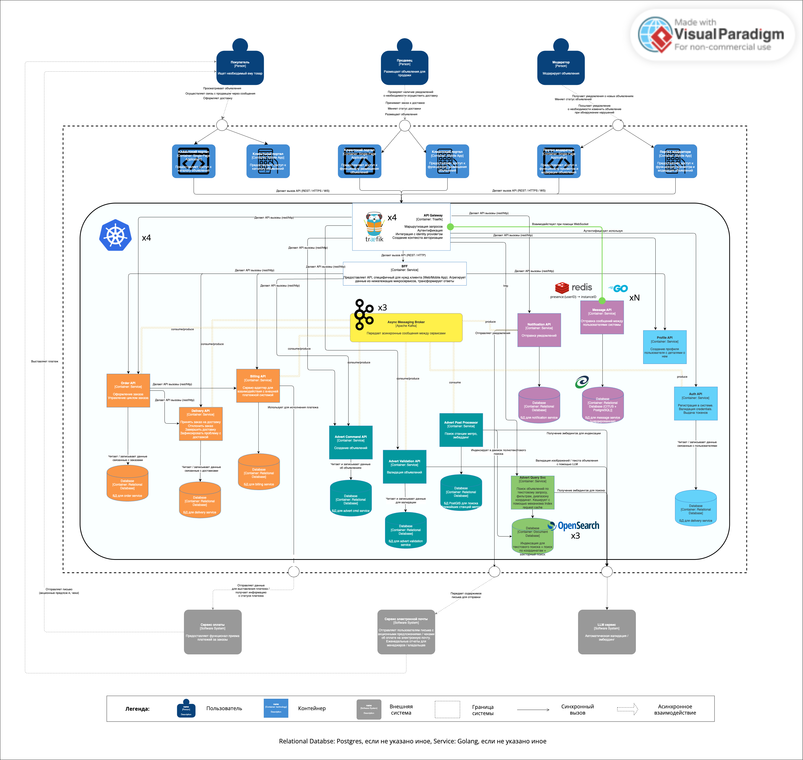

# Проектная работа: Интернет-сервис по размещению объявлений

Репозиторий деплоя всего стека микросервисов интернет-сервиса по размещению объявлений. Содержит Kubernetes-манифесты, Helm-чарт, скрипты сборки образов и интеграционные/смоук-тесты.

- **GitHub:** https://github.com/n-mark/final-project

## Диаграмма C4 (уровень контейнеров)



## Состав проекта

Конечная система состоит из следующих микросервисов и инфраструктурных компонентов:

| Компонент | GitHub | DockerHub |
|---|---|---|
| auth-service (аутентификация) | [n-mark/auth-svc](https://github.com/n-mark/auth-svc) | [`mblkuta/auth-service`](https://hub.docker.com/r/mblkuta/auth-service) |
| profile-service (профили) | [n-mark/profilesvc](https://github.com/n-mark/profilesvc) | [`mblkuta/profile-service`](https://hub.docker.com/r/mblkuta/profile-service) |
| order-service (заказы) | [n-mark/order-svc](https://github.com/n-mark/order-svc) | [`mblkuta/ordersvc`](https://hub.docker.com/r/mblkuta/ordersvc) |
| billing-service (биллинг) | [n-mark/billing-svc](https://github.com/n-mark/billing-svc) | [`mblkuta/billingsvc`](https://hub.docker.com/r/mblkuta/billingsvc) |
| notification-service (уведомления) | [n-mark/notificationsvc](https://github.com/n-mark/notificationsvc) | [`mblkuta/notificationsvc`](https://hub.docker.com/r/mblkuta/notificationsvc) |
| delivery-service (доставка) | [n-mark/delivery-service](https://github.com/n-mark/delivery-service) | [`mblkuta/delivery-service`](https://hub.docker.com/r/mblkuta/delivery-service) |
| dialog-service (диалоги) | [n-mark/dialog-svc](https://github.com/n-mark/dialog-svc) | [`mblkuta/dialog-svc`](https://hub.docker.com/r/mblkuta/dialog-svc) |
| advert-cmd-svc (command-сервис) | [n-mark/advert-cmd](https://github.com/n-mark/advert-cmd) | [`mblkuta/advert-cmd-svc`](https://hub.docker.com/r/mblkuta/advert-cmd-svc) |
| advert-query (поиск объявлений) | [n-mark/advert-query-go](https://github.com/n-mark/advert-query-go) | [`mblkuta/advert-query`](https://hub.docker.com/r/mblkuta/advert-query) |
| advert-validation-svc (валидация) | [n-mark/advert-validation](https://github.com/n-mark/advert-validation) | [`mblkuta/advert-validation-svc`](https://hub.docker.com/r/mblkuta/advert-validation-svc) |
| advert-postprocessor (постобработка) | [n-mark/advert-postprocessor](https://github.com/n-mark/advert-postprocessor) | [`mblkuta/advert-postprocessor`](https://hub.docker.com/r/mblkuta/advert-postprocessor) |
| BFF (backend for frontend) | [n-mark/advert-proj-bff](https://github.com/n-mark/advert-proj-bff) | [`mblkuta/advert-proj-bff`](https://hub.docker.com/r/mblkuta/advert-proj-bff) |
| final_project (этот репозиторий) | [n-mark/final-project](https://github.com/n-mark/final-project) | — |

Профиль DockerHub: https://hub.docker.com/u/mblkuta

## Инфраструктура

- **Traefik** — reverse proxy / API gateway
- **Kafka** — брокер сообщений (режим KRaft, без Zookeeper)
- **Redis** — кэш и pub/sub (используется dialog-service)
- **OpenSearch** — полнотекстовый поиск объявлений
- **PostgreSQL** — по отдельному инстансу на каждый сервис + PostGIS (справочник метро)
- **Prometheus** — сбор метрик

## Структура репозитория

```text
k8s/            # сырые Kubernetes-манифесты (применять по порядку)
helm/           # Helm-чарт всего стека
docker/scripts/ # вспомогательные скрипты (сборка и push образов)
tests/          # интеграционные / смоук-тесты (Newman)
```

## Быстрый старт (сырые k8s-манифесты)

1. Создаём namespace и секреты:

```bash
kubectl apply -f k8s/01-namespace/namespace.yaml
kubectl apply -f k8s/02-secrets/shared-secrets.yaml
```

2. Разворачиваем инфраструктуру (базы, брокеры, OpenSearch, Redis):

```bash
kubectl apply -f k8s/04-databases/
kubectl apply -f k8s/05-brokers/
kubectl apply -f k8s/06-opensearch/
```

3. Применяем сервисы:

```bash
kubectl apply -f k8s/03-configmaps/
kubectl apply -f k8s/08-services/
```

4. Поднимаем Traefik и публичный ingress:

```bash
kubectl apply -f k8s/09-traefik/
```

5. Создаём индекс-шаблон OpenSearch:

```bash
kubectl apply -f k8s/07-jobs/opensearch-index-job.yaml
```

## Деплой через Helm

```bash
helm upgrade --install final-project helm/final-project \
  --namespace final-proj --create-namespace
```

## Доступ через Traefik

При деплое в minikube добавьте в `/etc/hosts`:

```text
127.0.0.1 finalproj.local
```
Или публичный IP при использовании внешнего кластера

Публичные API доступны по адресу `http://finalproj.local/api/v1/...`.


## Сборка и публикация образов

```bash
./docker/scripts/build-and-push.sh [tag]
```

Скрипт собирает мульти-архитектурные (linux/amd64, linux/arm64) образы всех сервисов в registry `mblkuta` (по умолчанию тег `finalproj-latest`) и публикует их в DockerHub.

## Запуск Newman-тестов

Интеграционные / смоук-тесты находятся в `tests/newman/` и покрывают полный пользовательский сценарий (регистрация, подтверждение, логин, профиль, объявление, поиск, диалог, заказ, доставка, оплата, уведомления, BFF).

```bash
# Установить newman (если ещё не установлен)
npm install -g newman

# Запустить тесты
cd tests/newman
newman run tests/newman/final-project-newman-collection.json \
  --env-var "base_url=http://finalproj.local" \
  --timeout-request 30000
```

## Примечания

- Все сервисы по умолчанию используют Docker-тег `finalproj-latest`.
- Kafka развёрнут в режиме KRaft (без Zookeeper).
- OpenSearch настроен на 3 шарда / 2 реплики через индекс-шаблон.

## Удаление (Helm uninstall)

```bash
helm uninstall final-project --namespace final-proj
```

После удаления релиза namespace `final-proj` остаётся — при необходимости его можно удалить вручную:

```bash
kubectl delete namespace final-proj
```
